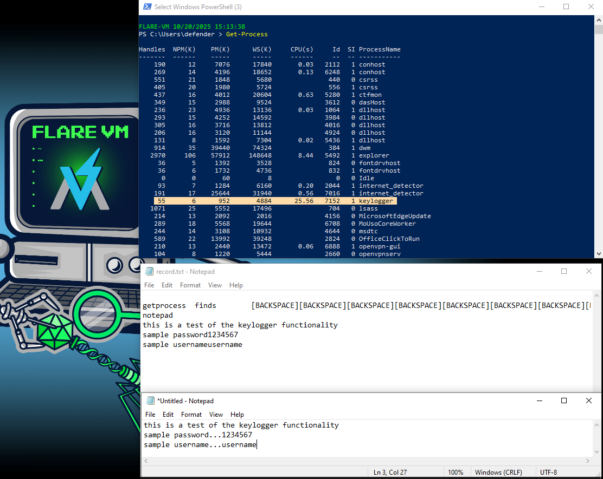

# KEYLOGGER

  

## OVERVIEW
This project is an educational research prototype intended to help security professionals, instructors, and students study the mechanics, detection, and mitigation of keystroke-capture techniques. It is not intended for covert monitoring or any use that would violate privacy, law, or organizational policy.

## CURRENT CAPABILITIES
* Capture basic ASCII keystrokes for demonstration and detection testing.
* Produce a local log for forensic analysis in lab environments.

## LIMITATION AND KNOWN ISSUES
* Prototype quality: designed for learning and detection testing, not production use.
* Limited key coverage: certain punctuation and modifier combinations are not yet handled.
* Not hardened for secure storage, tamper resistance, or privacy-preserving operation.

## FUTURE DEVELOPMENT
This tool is in early development and only 90% complete. It will be expanded to include:
* capturing the following missing keys (-, +)
* Broader key and layout coverage (including non-ASCII input and international keyboard layouts).
* Instrumentation hooks to help defenders detect the presence of keystroke capture.
* Documentation on how to create detection signatures

## DISCLAIMER:
This tool carries serious privacy and legal risks: secretive or excessive use undermines trust, may violate laws, and increases organizational liability. Ethical practice requires clear documentation, written consent, minimal data collection, secure storage, strict access controls, and testing only in isolated environments you control.

## USE CASES
* Blue team
   - understand how keylogger functionality works
* Blue-team training
   - building detectors and response playbooks.
* Red team
   - credential captures on a target system

## FILE INTEGRITY

#### SHA-256 CHECKSUM: 
 - PS D:\TMP\SHARED> Get-FileHash .\keylogger.exe -Algorithm SHA256
   Algorithm       Hash                                                                   Path
   ---------       ----                                                                   ----
   SHA256          837B22F8617CC09F4B71B1A34ADEC2FEB355FD72EB40458A5A056EB646797E15       D:\TMP\SHARED\keylogger.exe
