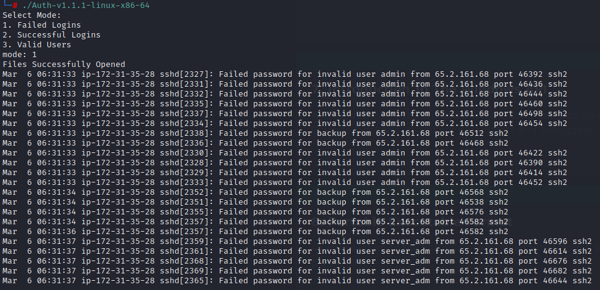

# AUTHLOG PARSER

  

## OVERVIEW
AUTHLOG PARSER is a lightweight C utility designed to help blue team analysts to quickly identify low-hanging fruits within the auth.log file, typically located at /var/log/auth.log. This tool is intended to simulate an early component of a HIDS, focusing on parsing authentication events and identifying suspicious patterns.

## CURRENT CAPABILITIES
### BRUTE FORCE DETECTION
* Scans for repeated failed login attempts

### SUCCESSFUL LOGIN LOGGING
* Lists successful logins for awareness and correlation.
  
## FUTURE DEVELOPMENT
This tool is in early development and will be expanded to include:
* Detection of command injection attempts based on login activity context.
* Integration with system user validation to differentiate mistyped credentials from malicious attempts
* Advanced parsing logic to correlate IP addresses, usernames, and frequency patterns.
* Additional detection modes based on emerging threat intelligence and blue team feedback.

## DISCLAIMER:
This tool doesn't replace a full-featured SIEM or HIDS. It is meant as a learning and support utility to aid in identifying basic threat indicators in authentication logs. Use it as a supplemental tool, not a primary defense mechanism.

## USE CASES
* Blue team analysts scanning Linux authentication logs for brute-force attempts
* Red team validating how their activity appears in auth logs
* CTF participants or cybersecurity students exploring host-based log forensics

## FILE INTEGRITY

#### SHA-256 CHECKSUM: 
 - sha256sum Auth-v1.1.1-linux-x86-64
    - 1510041b05f6254d455811ec03171677c9338d7ea1bd3b3465a282c6261604df  Auth-v1.1.1-linux-x86-64
