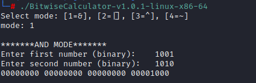

# BITWISE CALCULATOR

  

## OVERVIEW

This is a lightweight utility that allows users to perform bitwise operations such as AND, OR, XOR, and NOT using binary input. Results are displayed in formatted 32-bit binary output.

---

## FUTURE DEVELOPMENT

The calculator is in early development. Planned improvements include:

- CLI argument parsing for scripting or automation  
- Support for signed vs unsigned input  
- Bit masking and shifting utilities (`<<`, `>>`, `~`, masks)  
- Input/output in hex and decimal for comparison  
- Option for interactive mode vs single-execution mode  
- Improved error handling and user feedback  

---

## DISCLAIMER

This tool is intended for **educational** and **demonstration** purposes. It does not include full error handling or overflow checks. Use it to understand and debug bitwise logic — not for cryptographic or production-grade use.

---

## USE CASES

- Developers needing a quick CLI utility to visualize binary outcomes  
- Students learning how bitwise operations work in C

## FILE INTEGRITY

#### SHA-256 CHECKSUM: 
 - sha256sum BitwiseCalculator-v1.0.0-windows-x86-64.exe
   - ef77652499796507b8bd7f9287af084b0f9f0c763daf489d630c8a05117efa87  BitwiseCalculator-v1.0.0-windows-x86-64.exe
 - sha256sum BitwiseCalculator-v1.0.1-linux-x86-64      
   - e5a7c8c156f71d9d673a65e51986ce5fbc3d423a27f6df04bcee79afad60a108  BitwiseCalculator-v1.0.1-linux-x86-64
