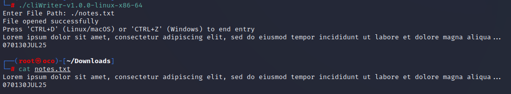

# CLI WRITER

  

## OVERVIEW
This is a lightweight CLI utility designed for quick direct text entry to a specified file path.

## CURRENT CAPABILITIES
### Character-by-Character Input
* Captures and writes input from STDIN until EOF is detected.
  
## FUTURE DEVELOPMENT
This tool is in early development and will be expanded in the future.

## DISCLAIMER:
This tool is a project developed to test my understanding of basic file system operations in C. It serves as a learning exercise and demonstration of proficiency in low-level file I/O handling using the C standard library.

## USE CASES
* N/A

## FILE INTEGRITY

#### SHA-256 CHECKSUM: 
 - sha256sum cliWriter-v1.0.0-linux-x86-64 
    - b89bcd5439b865c769b8fab7b7a67542d2983a5fb25482174790c371bda7570b  cliWriter-v1.0.0-linux-x86-64
