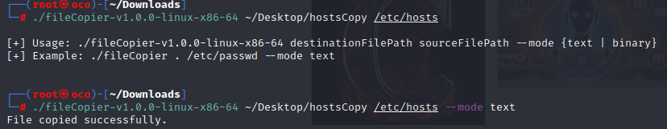

# FILECOPIER

  

## OVERVIEW  
This is a file duplication program designed to test my understanding of file I/O. It supports both text and binary file modes and is ideal for educational use, scripting, or systems where minimal dependencies are desired. This tool offers low-level file I/O control and basic error handling, making it a useful learning exercise for beginners or a utility for more experienced users in constrained environments.

## CURRENT CAPABILITIES  

### TEXT FILE COPY  
Reads and writes text files using standard `r`/`w` file modes.

### BINARY FILE COPY  
Handles binary files safely using `rb`/`wb` modes, preserving raw data integrity (e.g., images, executables).

### BASIC ERROR HANDLING  
Reports and exits gracefully when files cannot be accessed or written.

### MODE SELECTION  
Allows users to choose between `text` or `binary` modes via command-line arguments.

---

## FUTURE DEVELOPMENT  
This is a basic utility, but future plans may include:

- Overwriting protection with user confirmation  
- Recursive directory copying support  
- Checksum validation for copy verification  
- Progress indicators for large files  
- Logging of copy operations and failures  
- Optional compression before copying

---

## DISCLAIMER  
This utility is designed as a teaching tool or lightweight file copier. It is **not** a full-featured backup or data recovery solution. Use it with caution, especially when writing to critical file paths. Always verify your source and destination paths before execution.

---

## USE CASES
 * Developers learning file I/O in C
 * Systems engineers needing a small utility to copy logs or configs
 * Pentesters or red teamers creating minimal tools for exfiltration or evasion
 * Students experimenting with low-level C programming concepts

## FILE INTEGRITY

#### SHA-256 CHECKSUM:
 - sha256sum fileCopier-v1.0.0-linux-x86-64
    - 357caf651f577b1b1cff101c8d91336adfec2eaac9b16ec4cd3baca63cb1d14a  fileCopier-v1.0.0-linux-x86-64
