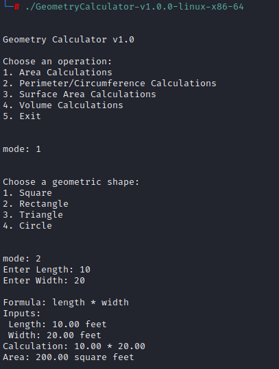

# GEOMETRY CALCULATOR

 

## OVERVIEW

This geometric calculator can be used for quick calculations involving 2D and 3D geometric shapes. Users can compute **area**, **perimeter/circumference**, **surface area**, and **volume** using standard geometric formulas and user-provided inputs.

---

## FUTURE DEVELOPMENT

This utility is still in development and planned future improvements include:

- Additional shapes (e.g., pyramid, cone)
- Unit conversion (e.g., feet ↔ meters)
- Colored terminal output for results and warnings
- Ability to save calculation history to a file
- Optional floating-point precision toggle

---

## DISCLAIMER

This tool is a lightweight, offline calculaor intended for educational use and as a C programming project. It is not intended to replace CAD tools or any other engineering calculators.

---

## USE CASES

- Engineering students practicing C and geometry fundamentals
- Cybersecurity students reinforcing modular programming and math handling in C

## FILE INTEGRITY

#### SHA-256 CHECKSUM: 
 - sha256sum GeometryCalculator-v1.0.0-linux-x86-64 
    - c80a4ba6d018a4ec074d02b9d52d99817e36a48c4459e74fce4b2dd83149d26a  GeometryCalculator-v1.0.0-linux-x86-64
 - sha256sum GeometryCalculator-v1.0.0-windows-x86-64.exe 
    - d8f0d677a4db0e93764b6242cf1a965ae75e4f0bcb6cd159ea872ee7bf362fc1  GeometryCalculator-v1.0.0-windows-x86-64.exe
