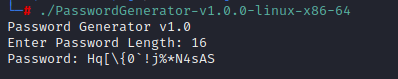

# PASSWORD GENERATOR

 

## OVERVIEW

This password generator is a lightweight C-based utility designed to generate randomized, secure passwords based on a user-specified length.

## CURRENT CAPABILITIES
### RANDOMIZED PASSWORD GENERATION
Generates passwords using a mix of:
- Uppercase Letters (A-Z)
- Lowercase Letters (a-z)
- Digits (0-9)
- Symbols (e.g., !@#$%^&*...)

### USER-DEFINED PASSWORD LENGTH
Accepts user input to generate passwords of arbitrary length (within buffer limits).

### CHARACTER SHUFFLING
Uses the Fisher-Yates (Knuth) shuffle to eliminate positional bias and ensure uniform randomness

## FUTURE DEVELOPMENT
- Minimum length and complexity enforcement
- Flags to include/exclude character categories (e.g., symbols only if specified)
- CLI argument support for script automation
- Entropy calculation for password strength estimation
- Optional output to file for toolchain use

## DISCLAIMER
This utility was created as a practical application of my C programming knowledge, specifically to reinforce my understanding of structured programming, modular design, and secure randomization techniques. It is intended for educational and development purposes only. It is intended to be used in lab environments or tooling experiments and NOT production systems.

## USE CASES
- Red team operators generating throwaway credentials during engagements
- Blue team engineers simulating strong password policy enforcement
- Cybersecurity students practicing systems programming and randomness

## FILE INTEGRITY

#### SHA-256 CHECKSUM: 
 - ea0ae7d40fea65b829a1e612763a067fd030b86934c6a575992f82aae6205a6b
