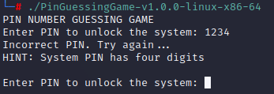

# PIN GUESSING GAME

<p align="center">
  
</p>

## OVERVIEW

This is a simple C-based terminal game that simulates a PIN guessing challenge. The user is prompted to guess a hardcoded 4-digit PIN to gain "access" to a simulated system. It's designed as a lightweight demonstration of **input validation**, **looping logic**, and **boolean control flow** in C.

---

## FEATURES

- Validates 4-digit integer input (scanf("%4d", ...))
- Provides feedback and a basic hint loop
- Reinforces do...while loop control and user interaction
- Uses bool to track system state (accessGranted flag)

---

## FUTURE DEVELOPMENT

This tool is intentionally minimal but can be extended to include:

- Randomized PIN generation
- Limited attempt count / lockout mechanism
- User-selectable PIN length (4-digit, 6-digit, etc.)
- Logging guessed attempts for pattern analysis
- Integration with file-based input or argument-based execution

---

## DISCLAIMER

This program is for **educational use** only. It is not meant to simulate real-world authentication systems and should not be used for any security-related applications.

---

## REVERSE ENGINEERING NOTE:

Students or researchers interested in learning how to **bypass the hardcoded PIN mechanism** through string/binary patching or stack-based redirection can follow step-by-step guides available on my GitBook:

- [String Patching](https://git.cnd.dev/playbook/sre/exploit-development/binary-exploitation/binary-modification/string-patching)
- [Binary Patching](https://git.cnd.dev/playbook/sre/exploit-development/binary-exploitation/binary-modification/binary-patching)
- [Stack Redirection](https://git.cnd.dev/playbook/sre/exploit-development/binary-exploitation/memory-corruption/buffer-overflow/stack-redirection)

These tutorials provide hands-on examples of basic software exploitation and binary modification techniques.

---

## USE CASES

- C programming students practicing loop control and conditional logic
- Cybersecurity learners exploring password guessing mechanics
- Basic terminal interaction and logic flow for beginners

## FILE INTEGRITY

#### SHA-256 CHECKSUM: 
 - sha256sum pinGuessingGame-v1.0.0-linux-x86-64
    - b468b6206561be73f37ea6ebd967e87706f6b809936d61b124996555b7c0b7d3  pinGuessingGame-v1.0.0-linux-x86-64
 - Get-FileHash -Path .\pinGuessingGame.exe -Algorithm SHA256
    - 5B74B30B854EFEB8D61545923C3113E28F8F98B991BEE6C1269FA99D6A56C9AF
---
PATCHED
 - Get-FileHash -Path .\PinGuessingGame-v1.0.0-windows-x86-64-PATCHED.exe -Algorithm SHA256                                                                                                                                       - 9737D3D4C51BDD8696BC8885A8969EA0854A9E0F914AFC2BE56DB78D662083A9
  

## REVERSE ENGINEERING BINARIES: WALKTHROUGH

### STEP 1:  IMPORT AND AUTO-ANALYZE PROJECT FILE

```
root@dev:~$ .\ghidra
ghidra > File > New Project > Non-Shared Project
 Project Directory: {PROJECTS}
 Project Name: {BINARY_PATCHING}
​
ghidra > File > Import File...
 Filename: {binaryWODebugSymbols.exe}
 
ghidra > Code Browser > binaryWODebugSymbols.exe
 Analyze: Yes
 Analysis Options: Default
 
 * Wait for analysis to finish..."Decompile" Section should look like below
    void entry(void)
​
    {
      __security_init_cookie();
      FUN_140001274();
      return;
    }
```

### STEP 2: BIG PICTURE OVERVIEW

```
ghidra > Sub-Menu > Display Function Graph

```

<p align="center">
  
</p>

### STEP 3: REBASE (IF REQUIRED)

#### IDENTIFY BASE ADDRESS (WINDBG)
```
PS C:\sre> WinDBG
 ...
​
WinDBG > File > Open Executable > PinGuessingGame-v1.0.0-windows-x86-64.exe
​
//list the modules and identify the "base address" of the program
WinDBG > Command
 0:000> lm
 Start          End          module_name
 00c00000       00c6b000     PinGuessingGame   (deferred)
 76a70000       76b60000     KERNEL32     (deferred)
 770f0000       7730c000     KERNELBASE   (deferred)
 77320000       774c4000     ntdll        (pdb symbols)     c:\ProgramData\dbg\sym\wntdll.
​
 /* ghidra will be set to the same "base address" found by WinDBG
    - Base Address: 00c00000
 */

```
#### APPLY BASE ADDRESS (GHIDRA)

```
Ghidra > Sub-Menu > Display Memory Map > Home Icon
 Base Image Address: 00c00000
 
 /* ghidra's default base address is 00400000 */
```

### STEP 4: HUNT MAIN()
#### IDENTIFY PATTERNS (RUNNING PROGRAM)
This may not always be accurate
```
PS C:\sre> .\PinGuessingGame-v1.0.0-windows-x86-64.exe
 PIN NUMBER GUESSING GAME
 Enter PIN to unlock the system: ...
 ...
```

#### LOCATE PATTERN (GHIDRA)
```
ghidra > File > Open > PinGuessingGame-v1.0.0-windows-x86-64.exe
 filter: main
 
 /* since there is no debug symbols when the executable was compiled, 
   main won't be found */

ghidra > Symbol Tree > Functions
 Filter: entry
 Decompile Section:
  void entry(void)
  {
    __security_init_cookie();
    FUN_140001274();
    return;
  }
 
 /* clicking on "entry" will automatically decompile it
    - entry is NOT main(), but leads to it
    - this will drop you to where ghidra thinks the main function can be located */
 
ghidra > Decompile > double-click "FUN_140001274"

 /* The "__scrt_common_main_seh()" is responsible for setting up exception handling and 
   eventually calling main().
    - Goal: Find __scrt_common_main();
    - if "__scrt_common_main_seh()" is NOT listed, look for alternatives such as...
      "FUN_..."
       - e.g., FUN_03ad1274()
       
 * __scrt_common_main_seh(); is a function commonly found in Windows executables 
   compiled with Microsoft's C runtime (CRT). It is part of the Microsoft Startup Code 
   and is involved in setting up exception handling for the main program.
    - this function is responsible for several things including...
       - Calling main() or WinMain(): Once the initialization is complete, it calls the
         user-defined main() (for console apps) or WinMain() (for GUI apps).
          - __scrt_common_main_seh(); is just a wrapper around main() or WinMain()
 
 * the __security_init_cookie(); is a function that initializes a global security 
   cookie used to detect stack buffer overflows at runtime. It is part of /GS 
   (Buffer Security Check), a compiler flag that adds stack canary protection to 
   functions that may be vulnerable to buffer overflows. */
      
#continue w/ working in reverse until the main function pattern is identified
 ...
 local_10 = DAT_140004000 ^ (ulonglong)auStack_38;
 puts("PIN NUMBER GUESSING GAME");
 FUN_140001020("Enter PIN to unlock the system: ",in_RDX,in_R8,in_R9);
 puVar2 = local_18;
 FUN_140001080(&DAT_1400022a4,puVar2,in_R8,in_R9);
 FUN_140001020("Access granted - System PIN cracked!",puVar2,in_R8,in_R9);
 iVar1 = FUN_140001170(local_10 ^ (ulonglong)auStack_38);
 return iVar1;
  
 /* if you see __{arbitraryString}...it means that its coming from imports
    - Symbol Tree > Imports > KERNEL32.DLL */

#typically, the first function encountered when working in reverse that DOESN'T start 
 w/ __ should be the main function
 
 iVar1 = FUN_00401010();
 _exit(iVar1);
 __cexit();
 return iVar1;
  
 * double click the FUN_00401010() in iVar1 = FUN_00401010(); to get to its 
   memory location
 
 undefined4 FUN_00401010(void)
 {
   int iVar1;
   
   iVar1 = FUN_00401000(1, 2, 3);
   _printf(&DAT_0040c000,iVar1);
   return 0;
 }
 
#rename and change the function signature to make it clear to ghidra that this is the main function

 ***********************
 *  FUNCTION           *
 ***********************
 undefined4 __stdcall FUN_00401010(void)    //hit the "l" key on the keyboard or right-click it to rename
  - rename FUN... to main
```

### STEP 5: LOCATE AND PATCH PERTINENT INSTRUCTION
#### INSTRUCTION TO PATCH
```
14000111d: 81 7c 24 20 39 05 00 00    cmp dword ptr [rsp + 0x20], 0x539
140001125: 74 15                      je  0x14000113c
```

#### PATCHED VERSION
```
14000111d: 39 c0   cmp eax, eax
14000111f: 90      nop
140001120: 90      nop
140001121: 90      nop
140001122: 90      nop
140001123: 90      nop
140001124: 90      nop

 /* This forces the comparison to always be equal (EAX == EAX), bypassing the PIN check */
```
#### OUTPUT
<p align="center">
  
</p>
