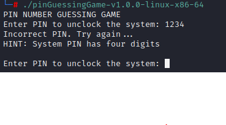

# PIN GUESSING GAME

  

## OVERVIEW

This is a simple C-based terminal game that simulates a PIN guessing challenge. The user is prompted to guess a hardcoded 4-digit PIN to gain "access" to a simulated system. It's designed as a lightweight demonstration of **input validation**, **looping logic**, and **boolean control flow** in C.

---

## FEATURES

- Validates 4-digit integer input (scanf("%4d", ...))
- Provides feedback and a basic hint loop
- Reinforces do...while` loop control and user interaction
- Uses bool to track system state (accessGranted flag)

---

## FUTURE DEVELOPMENT

This tool is intentionally minimal but can be extended to include:

- Randomized PIN generation
- Limited attempt count / lockout mechanism
- User-selectable PIN length (4-digit, 6-digit, etc.)
- Logging guessed attempts for pattern analysis
- Integration with file-based input or argument-based execution

---

## DISCLAIMER

This program is for **educational use** only. It is not meant to simulate real-world authentication systems and should not be used for any security-related applications.

---

## REVERSE ENGINEERING NOTE:

Students or researchers interested in learning how to **bypass the hardcoded PIN mechanism** through string/binary patching or stack-based redirection can follow step-by-step guides available on my GitBook:

- [String Patching](https://git.cnd.dev/playbook/sre/reverse-engineering/string-patching)  
- [Binary Patching](https://git.cnd.dev/playbook/sre/reverse-engineering/binary-patching)  
- [Stack Redirection](https://git.cnd.dev/playbook/sre/software-exploitation/stack-redirection)

These tutorials provide hands-on examples of basic software exploitation and binary modification techniques.

---

## USE CASES

- C programming students practicing loop control and conditional logic
- Cybersecurity learners exploring password guessing mechanics
- Basic terminal interaction and logic flow for beginners

## FILE INTEGRITY

#### SHA-256 CHECKSUM: 
 - 73c06c38311b1b698ceca73e28792e1dd9d2e35268bfa6497fffe3dd74ea8297
